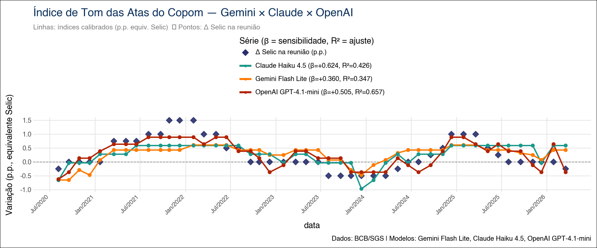

# Sentimento COPOM — Índice de Tom das Atas do Copom com Múltiplos LLMs

[](CHANGELOG.md)
[](https://www.python.org/)
[](https://quarto.org/)

Pipeline reprodutível em Python que constrói um **Índice de Tom *hawkish-dovish*** das atas do Comitê de Política Monetária (Copom) do Banco Central do Brasil utilizando **três LLMs em paralelo** — Gemini Flash Lite (Google), Claude Haiku 4.5 (Anthropic) e GPT-4.1-mini (OpenAI) — calibrado em pontos percentuais da Selic e validado em três camadas (in-sample, holdout, walk-forward).

O artefato final é um *paper* técnico em Quarto + LaTeX versionado formalmente, com duas edições paralelas: **base auditável** (chunks visíveis) e **edição do leitor** (chunks ocultos).



---

## Tese central

Os três modelos **concordam sobre a direção do tom** — qual ata é mais *hawkish* ou *dovish* — mas **divergem sobre a intensidade** com que essa direção se traduz em variação da Selic. A sensibilidade $\hat{\beta}$ varia de $+0{,}36$ a $+0{,}62$ p.p. por unidade de *score*, uma diferença de mais de 70%.

| Modelo | $R^2$ in-sample | $\hat{\beta}$ | RMSE walk-forward |
|---|---:|---:|---:|
| **GPT-4.1-mini** | **0,66** | $+0{,}50$ | **0,357** (líder) |
| **Claude Haiku 4.5** | 0,43 | $+0{,}62$ | ~0,67 |
| **Gemini Flash Lite** | 0,35 | $+0{,}36$ | ~0,67 |
| Baseline léxico | (ref.) | — | ~0,52 |

---

## Metodologia — CRISP-DM

| Fase | Aplicação |
|---|---|
| **Entendimento do Negócio** | Mensurar o tom das atas do Copom em escala interpretável e calibrá-lo na variação efetiva da Selic |
| **Entendimento dos Dados** | Atas do Copom (API BCB, a partir da reunião 232) + meta Selic (SGS 432); seções A (diagnóstico) e B (riscos) |
| **Preparação dos Dados** | Limpeza HTML, extração de seções, alinhamento ata × decisão Selic, cache local incremental em três níveis |
| **Modelagem** | Prompt unificado, saída Pydantic, três LLMs paralelos via LangChain, calibração OLS por modelo |
| **Avaliação** | Inferência *in-sample* (β̂, IC 95%), *holdout* das últimas 6 atas, *walk-forward* com janela expansiva (n=26) |
| **Implantação** | Pipeline Quarto reprodutível; cache CSV por provedor; sistema formal de releases |

---

## Estrutura do Projeto

```
Sentimento_COPOM/
├── sentimento_copom_IA_base.qmd       # paper técnico (echo: true)
├── sentimento_copom_IA_publico.qmd    # edição do leitor (echo: false)
├── referencias.bib                    # bibliografia compartilhada
├── atas_cache.json                    # cache de atas
├── selic_cache.json                   # cache da Selic
├── scores_{gemini,claude,openai}_cache.csv
├── CHANGELOG.md                       # histórico de releases
├── versions/v1.0_2026-04-26/          # snapshot da release
├── _rollback/                         # checkpoints ad-hoc
└── portfolio/                         # divulgação CRISP-DM
```

---

## Como rodar

### Pré-requisitos

- Python 3.11+
- Quarto ≥ 1.4
- TeX Live (para PDF)
- Chaves: Google AI Studio, Anthropic, OpenAI

### Instalação

```bash
git clone https://github.com/vitorwilher/Sentimento_COPOM.git
cd Sentimento_COPOM

python3 -m venv .venv
source .venv/bin/activate
pip install -r requirements.txt

cp .env.example .env  # edite com suas chaves
```

### Variáveis de ambiente

```bash
GOOGLE_API_KEY=...
ANTHROPIC_API_KEY=...
OPENAI_API_KEY=...
```

### Renderização

```bash
# Edição auditável (com chunks)
quarto render sentimento_copom_IA_base.qmd

# Edição do leitor (sem chunks)
quarto render sentimento_copom_IA_publico.qmd
```

### Reprocessamento total

```bash
rm scores_*_cache.csv
quarto render sentimento_copom_IA_base.qmd
```

Custo estimado para reprocessar a amostra completa: **< US\$ 1**.

---

## Sistema de Versões

### Edições paralelas

- `sentimento_copom_IA_base.qmd` — `echo: true`, mostra todos os chunks (auditável).
- `sentimento_copom_IA_publico.qmd` — `echo: false`, esconde chunks (leitor).

Diferem em **duas linhas**: `echo` no YAML e o sufixo "Edição do leitor" na *titlepage*. Mudanças de prosa atualizam **ambos**; mudanças de código vão só no `base.qmd`.

### CHANGELOG e snapshots

- **`CHANGELOG.md`** segue [Keep a Changelog](https://keepachangelog.com/pt-BR/1.1.0/).
- **`versions/vX.Y_YYYY-MM-DD/`** — snapshot completo a cada release.
- **`_rollback/`** — checkpoints ad-hoc dentro de uma sessão de trabalho.

### Convenção de bumps

| Tipo | Critério |
|---|---|
| **Major (vX.0)** | Nova rodada metodológica (ensemble, modelos maiores, nova validação) |
| **Minor (v1.X)** | Próximos passos atacados, novos achados, expansão de literatura |
| **Patch (v1.0.X)** | Correções de prosa, ajustes editoriais |

Veja o [CHANGELOG.md](CHANGELOG.md) para o histórico completo.

---

## Próximos Passos (v2.0)

1. Capacidade antecedente $t \to t+1$ (regressão preditiva)
2. Robustez a perturbações de *prompt* + variância entre execuções
3. Índice *ensemble* (média simples ou ponderada por $R^2$)
4. Inspeção qualitativa de divergências entre modelos
5. Modelos maiores (`gpt-4.1`, `claude-sonnet-4-5`, `gemini-2.5-pro`)
6. Probit ordenado para classificação de viés
7. Estender o pipeline aos comunicados oficiais
8. Surpresa de comunicação ortogonalizada (resíduo controlando expectativas Focus)

---

## Tecnologias

`Python` · `Quarto` · `LaTeX` · `LangChain` · `Pydantic` · `statsmodels` · `plotnine` · `google-genai` · `anthropic` · `openai`

---

## Autores

- **Vitor Wilher** — Bacharel e Mestre em Economia (UFF), candidato ao PhD em Economia (EPGE/FGV), especialista em Ciências de Dados e IA Generativa (PUC-Rio). Data Tech Lead na [Análise Macro](https://analisemacro.com.br). [GitHub](https://github.com/vitorwilher)
- **Luiz Henrique Barbosa Filho** — Bacharel em Ciência e Economia e em Ciências Contábeis (UNIFAL). Cientista de Dados e tutor na [Análise Macro](https://analisemacro.com.br). [LinkedIn](https://www.linkedin.com/in/luiz-henrique-barbosa-filho/)

---

## Referências principais

- Loughran, T.; McDonald, B. (2011). *When Is a Liability Not a Liability?*. *Journal of Finance*, 66(1), 35–65.
- Hansen, S.; Kazinnik, S. (2023). *Can ChatGPT Decipher Fedspeak?*.
- Apel, M.; Grimaldi, M. (2012). *The Information Content of Central Bank Minutes*. Riksbank.
- Blinder, A. S. et al. (2008). *Central Bank Communication and Monetary Policy*. *JEL*, 46(4).

Lista completa em [`referencias.bib`](referencias.bib).
