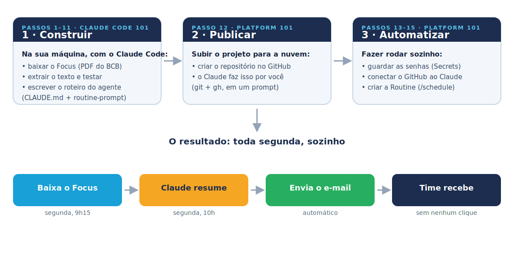

# 🎯 Apresentação {background-color="#1c2d4f"}

## O que você vai aprender

:::: {.columns}
::: {.column width="58%"}
- O que é o **Claude Code** e como funciona
- **Instalação** do ambiente, passo a passo
- O fluxo diário: **explore → plan → code → commit**
- Gerenciamento de contexto e *code review*
- Customização: **CLAUDE.md, subagents, skills, MCP, hooks**
- Construir, **ao vivo**, o projeto do **Boletim Focus**
:::
::: {.column width="42%"}

:::
::::

::: notes
Baseado no curso Claude Code 101 da Anthropic Academy. Exemplos pensados para projetos
de R/Python típicos da Análise Macro.
:::

# 🤖 O que é o Claude Code {background-color="#1c2d4f"}

## O que é o Claude Code

:::: {.columns}
::: {.column width="58%"}
- Um **agente de IA que roda no terminal** e atua sobre o seu projeto
- Lê e edita arquivos, roda comandos, executa testes, faz commits
- Trabalha no seu repositório local — entende o projeto inteiro
- Você descreve o objetivo; ele explora, planeja e implementa
:::
::: {.column width="42%"}

:::
::::

::: {.callout-tip}
## Diferença para o Chat
No Chat você copia e cola código. No Claude Code, o agente **mexe diretamente** nos seus
arquivos `.R`, `.py`, `.qmd` e roda o pipeline para você.
:::

## Como o Claude Code funciona

- Recebe seu pedido em linguagem natural
- Usa **ferramentas** (tools): ler/editar arquivos, buscar, rodar shell, etc.
- Opera em um **loop de agente**: pensa → age → observa → repete
- Pede confirmação antes de ações sensíveis (depende do modo de permissão)

. . .

**Exemplo:** "Leia `coleta_ipca.R`, descubra por que a chamada à API do BCB está falhando
e corrija." → ele lê, identifica o erro, edita e roda de novo.

# 🛠️ Preparando o ambiente {background-color="#1c2d4f"}

## A checklist de instalação {.smaller}

Tudo gratuito. Faça uma vez e está pronto para os próximos cursos:

| Ferramenta | Para quê | Onde |
|---|---|---|
| **VS Code** | editor onde tudo acontece | code.visualstudio.com |
| **Extensão Claude Code** | o agente dentro do VS Code | aba *Extensions* |
| **Node.js (LTS)** | requisito do Claude Code | nodejs.org |
| **Python 3.10+** | rodar o projeto Focus | python.org |
| **Git + GitHub CLI (`gh`)** | versionar e publicar | git-scm.com · cli.github.com |

## 1. VS Code + extensão Claude Code {.smaller}

1. Baixe e instale o **VS Code** em `code.visualstudio.com`
2. Abra o VS Code → ícone **Extensions** (`Cmd/Ctrl+Shift+X`)
3. Busque **"Claude Code"** → **Install**
4. Clique no ícone do Claude na barra lateral → **entre com sua conta Anthropic**

::: {.callout-tip}
Prefere o terminal? O Claude Code também roda como CLI:
`npm install -g @anthropic-ai/claude-code` e depois `claude` na pasta do projeto.
:::

## 2. Node, Python, Git e gh {.smaller}

```bash
# verifique se já tem (instale pelos sites se faltar):
node --version      # Node.js LTS  (nodejs.org)
python --version    # Python 3.10+ (python.org)
git --version       # Git          (git-scm.com)
gh --version        # GitHub CLI   (cli.github.com)

# autentique o GitHub uma vez:
gh auth login
```

::: {.callout-note}
No Windows, durante a instalação do Python marque **"Add Python to PATH"**. No Mac,
muita coisa vem via `brew install node python git gh` se você usa o Homebrew.
:::

## 3. Primeiro projeto e primeiro login

1. Crie uma pasta vazia (ex.: `resumo-focus/`) e **abra no VS Code**
   (*File → Open Folder*)
2. Abra o painel do **Claude Code** e confirme que está logado
3. O agente já "enxerga" essa pasta — é o contexto do projeto

. . .

::: {.callout-tip}
Rode sempre o Claude Code **na raiz do projeto**: é assim que ele lê o `CLAUDE.md`,
os arquivos e o histórico do git.
:::

# ⌨️ Seu primeiro prompt {background-color="#1c2d4f"}

## Seu primeiro prompt

- Seja específico sobre o objetivo e o resultado esperado
- O agente primeiro **explora** o projeto antes de mexer

. . .

```text
> Este repositório baixa e trata dados do IBGE. Crie um script
  novo `pib_trimestral.R` que baixe o PIB trimestral via API
  do SIDRA e salve um CSV limpo em data/.
```

::: {.callout-note}
Comece pequeno. Um pedido claro e delimitado gera resultados melhores do que "arrume
o projeto inteiro".
:::

# 🔁 Fluxos de trabalho diários {background-color="#1c2d4f"}

## Explore → Plan → Code → Commit

1. **Explore** — peça para o agente entender o código antes de agir
2. **Plan** — peça um **plano** antes de implementar (revise-o!)
3. **Code** — ele implementa em passos verificáveis
4. **Commit** — revise o diff e faça o commit

. . .

::: {.callout-tip}
Pedir o **plano antes** evita retrabalho — especialmente em pipelines de dados, onde uma
mudança quebra várias etapas a jusante.
:::

## Gerenciamento de contexto

- O agente tem uma **janela de contexto** limitada — ela enche em sessões longas
- `/clear` para começar do zero; `/compact` para resumir e seguir
- Aponte arquivos relevantes em vez de mandar ele "ler tudo"
- Tarefas grandes → divida em sessões focadas

::: {.callout-note}
Em projetos de dados, evite carregar CSVs gigantes no contexto. Peça para o agente
**inspecionar via código** (`head`, `str`, `.info()`) em vez de ler o arquivo inteiro.
:::

## Code review

- O Claude Code pode **revisar diffs** e apontar bugs, riscos e melhorias
- Útil antes de abrir um PR ou subir para produção
- Combina com *git*: revisar mudanças não commitadas ou um PR específico

. . .

```text
> Revise minhas mudanças não commitadas focando em erros de
  lógica no cálculo de juros compostos e em casos de borda.
```

# ⚙️ Customizando o Claude Code {background-color="#1c2d4f"}

## O arquivo CLAUDE.md

- Arquivo de **memória do projeto**, lido automaticamente em cada sessão
- Documente: stack, convenções, como rodar, fontes de dados, o que evitar
- Reduz repetição e melhora a consistência das respostas

. . .

```markdown
# CLAUDE.md
- Projeto em Python; dados do Focus (PDF do BCB).
- Convenção: arquivos focus_AAAA-MM-DD; data/ guarda PDF e texto.
- Regra de ouro: NUNCA inventar número — toda mediana citada está no texto.
```

## Subagents, Skills, MCP e Hooks {.smaller}

- **Subagents** — agentes auxiliares com contexto próprio (buscas, revisões)
- **Skills** — instruções + scripts empacotados para tarefas recorrentes
- **MCP** — conecta o agente a ferramentas/dados externos (GitHub, bancos, APIs)
- **Hooks** — comandos automáticos em eventos (ex.: rodar `pytest` antes do commit)

::: {.callout-note}
Esses recursos voltam no **projeto do Focus**: o `CLAUDE.md` (briefing), o
`routine-prompt.md` (parente das skills) e, no Platform 101, o **MCP do GitHub**.
:::

# 📊 Projeto guia: construindo o Boletim Focus {background-color="#1c2d4f"}

## A sequência do projeto, do início ao fim



::: {.callout-tip}
**1** construir na máquina · **2** publicar no GitHub · **3** automatizar na nuvem.
:::

## A meta desta parte {.smaller}

:::: {.columns}
::: {.column width="56%"}
Construir, **ao vivo no VS Code**, o projeto que baixa o Focus, prepara o resumo e já
deixa a automação pronta — **tudo na sua máquina**.

São **15 passos** até a Routine. Aqui vamos do **Passo 1 ao 11**; publicar no GitHub e
automatizar (12–15) é o **Platform 101**.
:::
::: {.column width="44%"}

:::
::::

::: {.callout-note}
## Guia completo, com todos os prompts
[analisemacro.github.io/imersao-claude-code/aula04-16062026.html](https://analisemacro.github.io/imersao-claude-code/aula04-16062026.html)
:::

## Passo 1 — A fundação: pastas e o `CLAUDE.md`

::: {.prompt}
```text
Estou começando um projeto Python do zero nesta pasta vazia. O objetivo é
baixar toda semana o boletim Focus do Banco Central (um PDF), extrair o
texto e, mais tarde, gerar e entregar um resumo. Faça duas coisas:

1. Crie a estrutura de pastas: src/, tests/, data/, output/focus/ e
   .github/workflows/.
2. Crie um CLAUDE.md na raiz com o briefing: objetivo, fonte (página e PDF
   do Focus no bcb.gov.br), convenções (focus_AAAA-MM-DD; data/ guarda PDFs
   e textos) e regras (nunca inventar número; se segunda é feriado, o
   download retrocede dia a dia até achar o PDF).

Me mostre a árvore de pastas e o CLAUDE.md.
```
:::

## Passo 2 — As dependências

::: {.prompt}
```text
Crie requirements.txt fixando requests 2.32.3, pdfplumber 0.11.4 e
pytest 8.3.3. E um pytest.ini com um marker `network` (descrição: testes de
rede, pulam com -m "not network") e testpaths apontando para tests.
```
:::

## Passo 3 — O download: `baixar_focus.py`

::: {.prompt}
```text
Crie src/baixar_focus.py: uma função ultima_segunda(hoje) que retorna a
segunda mais recente ESTRITAMENTE anterior a hoje; uma função baixar(dest)
que parte da última segunda e tenta baixar R{AAAAMMDD}.pdf, recuando um dia
por tentativa (até 7), validando os bytes %PDF, salvando focus_AAAA-MM-DD.pdf
e retornando (data, caminho); use User-Agent de navegador e um main() que
baixe para data/. Comente em português.
```
:::

## Passo 4 — A extração: `extrair_texto.py`

::: {.prompt}
```text
Crie src/extrair_texto.py: uma função extrair(pdf_path) que abre o PDF com
pdfplumber, junta o texto das páginas e salva um .txt de mesmo nome (UTF-8),
retornando o caminho; um main() com --pdf opcional que, sem ele, usa o
focus_*.pdf mais recente de data/. Comente em português.
```
:::

## Passo 5 — A cola: `demo.py` (e o pipeline roda)

::: {.prompt}
```text
Crie demo.py na raiz: adiciona src/ ao path, importa baixar e extrair, baixa
para data/, imprime "[1/2] PDF baixado..." e "[2/2] Texto extraído...", e
aceita --abrir para abrir o .txt. Depois instale o requirements e rode
`python demo.py --abrir`, me mostrando a saída.
```
:::

```bash
python -m pip install -r requirements.txt
python demo.py --abrir
```

## Passo 6 — A rede de segurança: os testes

::: {.prompt}
```text
Crie tests/test_baixar_focus.py: cinco testes puros para ultima_segunda
(quinta, terça, hoje-é-segunda recua uma semana, domingo, varredura de 60
dias) e um teste @pytest.mark.network que baixa de verdade e valida o
arquivo. Rode `pytest -m "not network"` e me mostre o resultado.
```
:::

## Passo 7 — Os arquivos que faltam (e o Action de coleta)

::: {.prompt}
```text
Crie: README.md descrevendo o projeto; .gitignore (ignora __pycache__/,
.pytest_cache/, *.pyc, .venv/, .env; comenta que output/focus/ é versionado);
output/focus/.gitkeep; e .github/workflows/focus-download.yml — Action que
roda toda segunda às 9h15 BRT (12h15 UTC) e por workflow_dispatch, faz
checkout, instala o requirements, roda baixar_focus.py e extrair_texto.py e
commita data/focus_*.{pdf,txt} de volta (permissão contents: write).
```
:::

## Passo 8 — O roteiro da Routine: `routine-prompt.md`

::: {.prompt}
```text
Você está executando a Routine de resumo semanal do Focus. O download e a
extração já foram feitos por um GitHub Action. Sua tarefa: ler o .txt mais
recente de data/, gerar um resumo em HTML com a logo da Análise Macro e
deixá-lo como rascunho de e-mail no Gmail.

[localizar .txt → checar frescor → sanity check (IPCA/Selic/PIB) → escrever
resumo executivo + 3 revisões → montar HTML → criar rascunho]

Nunca invente número.
```
:::

## Passo 9 — Ensinar o projeto a enviar: `enviar_email.py`

::: {.prompt}
```text
Crie src/enviar_email.py, que envia o resumo HTML do Focus por e-mail via
SMTP do Gmail. Requisitos:
- NUNCA colocar credenciais no código. Ler de variáveis de ambiente:
  FOCUS_SMTP_USER, FOCUS_SMTP_APP_PASSWORD, FOCUS_EMAIL_DEST e FOCUS_EMAIL_BCC.
- Uma função que acha o focus_*.html mais recente em output/focus/.
- Montar e-mail com corpo HTML (e fallback texto), assunto "Resumo Focus —
  AAAA-MM-DD" e enviar por smtp.gmail.com:465 (SSL) com a senha de app.
- main() com --html, --dest, --assunto e --dry-run (monta e mostra SEM enviar).
Comente em português e me mostre o arquivo.
```
:::

## Passo 10 — O segundo Action: `focus-enviar.yml`

::: {.prompt}
```text
Crie .github/workflows/focus-enviar.yml: um Action que dispara no push de um
output/focus/focus_*.html na branch main (e por workflow_dispatch). Faz
checkout, instala o requirements e roda src/enviar_email.py, passando como
variáveis de ambiente os Secrets FOCUS_SMTP_USER, FOCUS_SMTP_APP_PASSWORD,
FOCUS_EMAIL_DEST e FOCUS_EMAIL_BCC.
```
:::

## Passo 11 — Atualizar o roteiro: rascunho → envio automático

::: {.prompt}
```text
Atualize o routine-prompt.md: troque o passo final (que criava um rascunho
com create_draft) por "publicar o HTML": fazer git add do
output/focus/focus_AAAA-MM-DD.html, commit e git push para main, explicando
que é esse push que dispara o Action de envio (focus-enviar.yml). Mantenha os
passos de frescor, sanity check e "nunca invente número"; nas regras de
parada, troque "pare sem enviar e-mail" por "pare sem commitar o HTML".
```
:::

## Tudo pronto na sua máquina {.smaller}

:::: {.columns}
::: {.column width="56%"}
Com os **Passos 1–11**, o projeto está completo localmente: baixa, extrai, testa, tem o
roteiro do agente e já sabe enviar.

➡️ Falta **publicar no GitHub** e ligar a automação na nuvem (Passos 12–15) — isso é o
**Claude Platform 101**.
:::
::: {.column width="44%"}

:::
::::

::: {.callout-note}
## Continua no guia
[analisemacro.github.io/imersao-claude-code/aula04-16062026.html](https://analisemacro.github.io/imersao-claude-code/aula04-16062026.html)
:::

# ✅ Conclusão {background-color="#1c2d4f"}

## Mensagens-chave

- O Claude Code é um **agente no terminal** que atua no seu projeto
- Trabalhe no ciclo **explore → plan → code → commit**
- Gerencie o **contexto**; use *code review* antes de subir
- Customize com **CLAUDE.md, subagents, skills, MCP e hooks**
- Construímos o Focus do **Passo 1 ao 11** — pronto para publicar

## Próximos passos

- Refazer o projeto do Focus na sua máquina, prompt a prompt
- Criar um `CLAUDE.md` em um projeto real da Análise Macro
- Avançar para **Claude Platform 101**: publicar e criar a **Routine**

. . .

**Obrigado!** — Análise Macro
