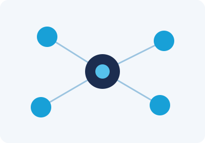

# 🎯 Apresentação {background-color="#1c2d4f"}

## O que você vai aprender

:::: {.columns}
::: {.column width="58%"}
- O que é a **Claude Developer Platform** (a API)
- Sua **primeira chamada de API** (com setup)
- **Agent loop**, **tool use**, **thinking** e ferramentas
- **Skills**, **MCP** e gerenciamento de contexto
- **Managed agents** e **Routines** — o agente que trabalha sozinho
- Fechamos o **Boletim Focus**: do GitHub à Routine (Passos 12–15)
:::
::: {.column width="42%"}

:::
::::

::: {.callout-note}
## Guia completo, com todos os 15 passos
[analisemacro.github.io/imersao-claude-code/aula04-16062026.html](https://analisemacro.github.io/imersao-claude-code/aula04-16062026.html)
:::

# 🧱 Fundamentos {background-color="#1c2d4f"}

## A Claude Developer Platform

- É a **API**: você fala com o Claude **a partir do seu código**, não do chat
- Mesma inteligência do claude.ai, agora **programável e em escala**
- Você envia mensagens e ferramentas; recebe respostas estruturadas
- Base para **automações, pipelines e agentes**

::: {.callout-note}
Para um economista: em vez de colar um boletim no chat toda semana, seu **programa**
chama o Claude automaticamente para cada novo Focus.
:::

## Preparando o acesso (setup) {.smaller}

1. Crie uma conta em **console.anthropic.com**
2. Gere uma **API key** (*Settings → API Keys*) e guarde com cuidado
3. Exporte a chave como variável de ambiente e instale o SDK:

```bash
export ANTHROPIC_API_KEY="sk-ant-..."   # nunca coloque a chave no código
pip install anthropic                    # SDK Python
```

::: {.callout-warning}
A API key é como uma senha: **nunca** vai para o GitHub. Use variáveis de ambiente
(local) e **Secrets** (na nuvem) — exatamente o que faremos na Routine.
:::

## Sua primeira chamada de API {.smaller}

```python
import anthropic

client = anthropic.Anthropic()  # lê ANTHROPIC_API_KEY do ambiente

msg = client.messages.create(
    model="claude-sonnet-4-6",
    max_tokens=400,
    messages=[
        {"role": "user",
         "content": "Resuma em 3 bullets as mensagens do COPOM sobre a Selic."}
    ],
)
print(msg.content[0].text)
```

- `messages` é a conversa; `model` escolhe o modelo; `max_tokens` limita a resposta

## Escolhendo o modelo certo {.smaller}

| Modelo | Perfil | Bom para |
|---|---|---|
| **Opus 4.8** (`claude-opus-4-8`) | mais capaz | análises complexas, raciocínio longo |
| **Sonnet 4.6** (`claude-sonnet-4-6`) | equilíbrio | a maioria das tarefas — incl. a Routine |
| **Haiku 4.5** (`claude-haiku-4-5...`) | rápido e barato | classificações, tarefas simples em volume |

. . .

::: {.callout-tip}
Regra prática: comece no **Sonnet**. Suba para **Opus** se a tarefa exige raciocínio
pesado; desça para **Haiku** quando é simples e em grande quantidade.
:::

# 🔄 O agent loop e as ferramentas {background-color="#1c2d4f"}

## O agent loop

Um **agente** não responde uma vez só — ele **age em ciclo**:

1. **Pensa** no objetivo
2. **Usa uma ferramenta** (baixar, ler, calcular, commitar)
3. **Observa** o resultado
4. **Repete** até concluir

. . .

::: {.callout-note}
A Routine do Focus é esse loop: ler o `.txt` → conferir os números → redigir →
montar o HTML → publicar.
:::

## O que é tool use {.smaller}

- **Tool use**: você descreve ferramentas e o Claude decide **quando chamá-las**
- Ele devolve "quero chamar a ferramenta X com estes argumentos"; seu código executa

```python
tools = [{
  "name": "mediana_focus",
  "description": "Retorna a mediana de mercado de um indicador no Focus",
  "input_schema": {
    "type": "object",
    "properties": {"indicador": {"type": "string"}},
    "required": ["indicador"]
  }
}]
```

- Assim o Claude **busca o número real** em vez de inventar

## O que é thinking

- Modelos podem **raciocinar antes de responder** (*extended thinking*)
- Útil quando a tarefa exige **passos de lógica**, não só recuperar texto
- Ex.: reconciliar revisões do Focus, checar se uma variação faz sentido

. . .

::: {.callout-tip}
Mais "pensamento" = respostas melhores em problemas difíceis, ao custo de mais tempo
e tokens. Ligue quando a análise é não-trivial.
:::

## Built-in tools

- A plataforma oferece **ferramentas prontas**, hospedadas pela Anthropic:
  - **Web search** — buscar informação atual
  - **Code execution** — rodar código para calcular/validar
- Você ativa sem precisar implementar a ferramenta

. . .

**Exemplo:** pedir ao Claude que **calcule a variação %** entre duas projeções do Focus
usando *code execution* — conta feita por código, não "no chute".

# 🧩 Estendendo o agente {background-color="#1c2d4f"}

## Skills

- **Skills** empacotam instruções + arquivos para uma tarefa recorrente
- O modelo carrega a skill certa **sob demanda**
- Padronizam o **formato** e a **qualidade** da entrega

. . .

::: {.callout-note}
No Focus, o **`routine-prompt.md`** funciona como a "skill" da Routine: o roteiro fixo
de como montar o resumo (frescor → sanity check → redação → HTML).
:::

## MCP

:::: {.columns}
::: {.column width="58%"}
- **Model Context Protocol**: padrão para conectar o agente a **ferramentas e dados
  externos**
- Servidores MCP expõem capacidades: GitHub, bancos de dados, APIs
- O agente passa a **ler repositórios, consultar bases, dar push**
:::
::: {.column width="42%"}

:::
::::

::: {.callout-tip}
A Routine do Focus usa o **conector MCP do GitHub** para ler o repositório e **commitar
o HTML** do resumo.
:::

## Gerenciamento de contexto

- A **janela de contexto** é finita — não dá para "ler o repositório inteiro"
- Boas práticas: trazer **só o necessário** (o `.txt` mais recente, não todos)
- Resumir, paginar, apontar arquivos específicos

::: {.callout-note}
A Routine lê **apenas o boletim da semana** — contexto enxuto, resposta focada e barata.
:::

# 🤖 Managed agents e Routines {background-color="#1c2d4f"}

## O que são managed agents

- Agentes que rodam na **infraestrutura da Anthropic** — você não hospeda servidor
- Recebem um objetivo, usam ferramentas (via MCP) e entregam o resultado
- Uma **Routine** é um managed agent **agendado** (roda sozinho no horário)

. . .

::: {.callout-tip}
É o pulo do gato: sai do "rodo na minha máquina" (Passos 1–11, no Code 101) para
"**roda na nuvem, no horário, sem mim**" (Passos 12–15, aqui).
:::

## O fluxo do Focus, ponta a ponta {.smaller}

```text
⚙️  Action coleta   →  🧠 Routine resume  →  📧 Action envia  →  👥 Time recebe
   (seg 9h15)            (seg 10h)             (no push)          (automático)
   baixa + extrai        lê .txt, redige,      SMTP do Gmail
   commita o .txt        commita o HTML        com Secrets
```

- **Determinístico** (scripts Python nos Actions) faz baixar, extrair, enviar
- **Interpretação** (a Routine, um LLM) faz **ler e redigir** o resumo

## Passo 12 — Publicar no GitHub

::: {.prompt}
```text
Publique esta pasta no GitHub. Faça nesta ordem e me mostre a saída:
1. git init e branch principal main.
2. Primeiro commit com todos os arquivos, mensagem no imperativo.
3. gh repo create resumo-focus --public --source=. --remote=origin --push
4. Me mostre a URL do repositório.
```
:::

Depois, dispare o Action de coleta à mão (aba **Actions** → **Run workflow**) e confira
os `data/focus_*.{pdf,txt}` na `main`.

## Passo 13 — Credenciais: App Password + Secrets {.smaller}

1. No Google: ligue a **verificação em 2 etapas** e gere uma **senha de app**
   (16 dígitos) em `myaccount.google.com/apppasswords`
2. Guarde nos **Secrets do GitHub** (pelo Claude Code, via `gh`):

::: {.prompt}
```text
gh secret set FOCUS_SMTP_USER         --repo SEU-USUARIO/resumo-focus
gh secret set FOCUS_SMTP_APP_PASSWORD --repo SEU-USUARIO/resumo-focus
gh secret set FOCUS_EMAIL_DEST        --repo SEU-USUARIO/resumo-focus
gh secret set FOCUS_EMAIL_BCC         --repo SEU-USUARIO/resumo-focus
```
:::

## Passo 14 — Conectar o Claude ao GitHub {.smaller}

A Routine roda remota: precisa de dois acessos ao GitHub.

- **App** (a permissão): em `github.com/apps/claude`, instale marcando só o
  repo `resumo-focus` — com permissão de **push**
- **Conector MCP** (as ferramentas): em `claude.ai → Connectors → GitHub → Connect`
  (se não aparecer, use `https://api.githubcopilot.com/mcp`)

::: {.callout-warning}
**App e MCP andam juntos**: o App dá a entrada no repo; o MCP dá as ferramentas para
agir. Um sem o outro não funciona.
:::

## Passo 15 — Criar a Routine

::: {.prompt}
```text
Crie uma Routine agendada com o /schedule:
- Nome: resumo-focus
- Repositório: seu-usuario/resumo-focus (com push habilitado)
- Agenda (cron): 0 13 * * 1  — toda segunda às 13h UTC (10h BRT)
- Modelo: claude-sonnet-4-6
- Conector MCP: o github (ler o repo e dar push no HTML)
- Prompt da Routine: use exatamente o conteúdo do routine-prompt.md
Antes de criar, me mostre o resumo da configuração para eu confirmar.
```
:::

## O primeiro disparo

- Não espere até segunda: rode **"Run now"** (ou `/schedule run resumo-focus`)
- A Routine **clona o repo → lê o `.txt` → sanity check → monta o HTML → commita**
- O push aciona o Action de envio → o **e-mail chega** ao time

. . .

::: {.callout-tip}
Cadastre seu e-mail no `FOCUS_EMAIL_BCC` para **receber uma cópia** de cada disparo e
acompanhar a qualidade.
:::

# 🛠️ Construindo com o Claude Code {background-color="#1c2d4f"}

## Plataforma + Claude Code

- O **Claude Code** é, ele mesmo, um agente construído sobre a plataforma
- Você usou ele para **escrever o projeto**; a **Routine** o coloca para rodar sozinho
- Para ir além, o **Agent SDK** permite criar seus próprios agentes em código

. . .

::: {.callout-tip}
Mesma base, três formas: **chat** (Claude 101), **agente no terminal** (Code 101),
**agente programável/agendado** (Platform 101).
:::

# ✅ Conclusão {background-color="#1c2d4f"}

## Mensagens-chave

- A **plataforma** é o Claude **programável**: API, ferramentas e agentes
- O **agent loop** + **tool use** + **MCP** dão **ações** ao modelo
- **Managed agents / Routines** fazem o trabalho **rodar sozinho na nuvem**
- Separe **determinístico** (scripts) de **interpretação** (LLM)
- Segurança primeiro: **API key e senhas em variáveis de ambiente / Secrets**

## O fim da jornada {.smaller}

:::: {.columns}
::: {.column width="58%"}
De uma pasta vazia a um **sistema que trabalha sozinho** — em **15 passos**:

- **Claude 101** — o conceito e a redação
- **Code 101** — Passos 1–11: o projeto, construído ao vivo
- **Platform 101** — Passos 12–15: a Routine, rodando toda segunda

O resumo do Focus chega ao time **sem ninguém apertar nada**.
:::
::: {.column width="42%"}

:::
::::

::: {.callout-note}
Guia: [analisemacro.github.io/imersao-claude-code/aula04-16062026.html](https://analisemacro.github.io/imersao-claude-code/aula04-16062026.html)
:::

. . .

**Obrigado!** — Análise Macro
