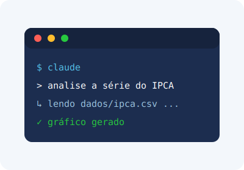

# 🎯 De onde paramos {background-color="#1c2d4f"}

## O que você já viu (Introdução ao MCP)

:::: {.columns}
::: {.column width="58%"}
- **MCP** conecta o Claude a sistemas externos por um protocolo padrão
- No básico você viu os três blocos servidos por um servidor:
  - **Tools** — ações que o modelo pode executar
  - **Resources** — dados que o modelo pode ler
  - **Prompts** — modelos de instrução reutilizáveis
- Tudo isso era o servidor **falando** com o cliente
:::
::: {.column width="42%"}

:::
::::

::: notes
Este deck é a sequência do "Introdução ao MCP". Assumimos que o público já entende
tools/resources/prompts e a relação host–cliente–servidor.
:::

## O que vamos avançar aqui

- **Sampling** — o servidor pede ao cliente uma chamada de LLM
- **Notificações** — logs e progresso de tarefas longas
- **Roots** — fronteiras de acesso a arquivos
- **JSON-RPC** — as mensagens por baixo do protocolo
- **Transportes** — STDIO (local) e StreamableHTTP (remoto), e **estado** para produção

. . .

::: {.callout-tip}
## A virada de chave
No básico, o servidor **respondia**. Aqui ele aprende a **pedir**, **avisar** e a **rodar
remotamente** — o que separa um exemplo de aula de um servidor de produção.
:::

# 🔁 Sampling {background-color="#1c2d4f"}

## O servidor pede ajuda ao cliente

:::: {.columns}
::: {.column width="58%"}
- **Sampling** inverte o fluxo: o **servidor** solicita uma chamada de LLM, e o
  **cliente** (host) a executa
- O servidor **não precisa** de chave de API nem de modelo próprio
- O host mantém o controle: escolhe o modelo, custos e pode exigir aprovação humana
:::
::: {.column width="42%"}

:::
::::

::: {.callout-tip}
## Analogia
O servidor é um **estagiário sem acesso ao Bloomberg**: quando precisa de uma análise,
ele **pede ao chefe** (o cliente), que tem as ferramentas e decide se autoriza.
:::

## Sampling na prática

Uma tool dispara, de volta ao cliente, um pedido de geração:

```python
@mcp.tool()
async def classificar_tom_ata(texto: str, ctx: Context) -> str:
    """Classifica o tom de uma ata do COPOM como dovish/neutro/hawkish."""
    resultado = await ctx.session.create_message(
        messages=[
            SamplingMessage(
                role="user",
                content=TextContent(
                    type="text",
                    text=f"Classifique o tom (dovish/neutro/hawkish):\n\n{texto}",
                ),
            )
        ],
        max_tokens=100,
    )
    return resultado.content.text
```

. . .

::: {.callout-note}
O servidor não chamou nenhuma API. Ele só **descreveu** o que queria — quem pagou e
executou foi o cliente.
:::

# 📣 Notificações: logs e progresso {background-color="#1c2d4f"}

## Avisar sem esperar resposta

:::: {.columns}
::: {.column width="58%"}
- **Notificações** são mensagens do servidor ao cliente **sem resposta** esperada
- Dois usos centrais:
  - **Logging** — mensagens em níveis (info, warning, error)
  - **Progress** — andamento de operações longas
- Melhoram muito a experiência em tarefas demoradas
:::
::: {.column width="42%"}

:::
::::

::: {.callout-tip}
## Analogia
É a **barra de progresso** do download: você não interage com ela, mas saber que vai em
"3 de 4" evita a sensação de que o programa travou.
:::

## Emitindo progresso de uma tarefa longa

```python
@mcp.tool()
async def baixar_series_bcb(codigos: list[int], ctx: Context) -> str:
    """Baixa várias séries do SGS do Banco Central, reportando progresso."""
    total = len(codigos)
    for i, codigo in enumerate(codigos, start=1):
        await ctx.info(f"Baixando série {codigo}...")
        # ... baixa e processa a série ...
        await ctx.report_progress(progress=i, total=total)
    return f"{total} séries baixadas."
```

. . .

- `ctx.info(...)` envia um **log**; `ctx.report_progress(...)` envia o **andamento**
- O cliente decide como exibir (console, UI, ignorar)

# 🗂️ Roots: fronteiras de acesso {background-color="#1c2d4f"}

## Onde o servidor pode olhar

:::: {.columns}
::: {.column width="58%"}
- **Roots** são os diretórios que o **cliente autoriza** o servidor a acessar
- Servem para **segurança** (o servidor não vasculha o disco inteiro) e para
  **descoberta** (ele sabe onde estão os dados relevantes)
- O cliente declara os roots; o servidor **consulta** a lista
:::
::: {.column width="42%"}

:::
::::

::: {.callout-tip}
## Analogia
É um **crachá** que abre só algumas portas do prédio. O servidor circula apenas onde
foi autorizado — por exemplo, somente a pasta `dados/` do projeto.
:::

## Consultando os roots autorizados

```python
@mcp.tool()
async def listar_arquivos_de_dados(ctx: Context) -> list[str]:
    """Lista os diretórios que o cliente autorizou (roots)."""
    resultado = await ctx.session.list_roots()
    return [str(root.uri) for root in resultado.roots]
```

. . .

::: {.callout-note}
O servidor **pergunta** "onde posso trabalhar?" em vez de assumir caminhos fixos. Isso
torna o mesmo servidor portátil entre máquinas e usuários — e mais seguro.
:::

# 🔧 As mensagens por baixo (JSON-RPC) {background-color="#1c2d4f"}

## MCP fala JSON-RPC 2.0

- Toda a comunicação MCP é **JSON-RPC 2.0**, e é **bidirecional**
- Três tipos de mensagem:

| Tipo | Tem `id`? | Espera resposta? |
|---|---|---|
| **Request** | sim | sim |
| **Response** | sim (mesmo do request) | — |
| **Notification** | não | não |

. . .

::: {.callout-note}
A regra prática: se a mensagem tem `id`, alguém vai responder. **Notificações não têm
`id`** — por isso são "avisos" e não "perguntas".
:::

## Anatomia das mensagens

```json
// Request (cliente → servidor): executar uma tool
{ "jsonrpc": "2.0", "id": 7, "method": "tools/call",
  "params": { "name": "baixar_series_bcb", "arguments": { "codigos": [433, 1178] } } }

// Notification (servidor → cliente): progresso, sem id
{ "jsonrpc": "2.0", "method": "notifications/progress",
  "params": { "progressToken": "abc", "progress": 1, "total": 2 } }
```

. . .

- Entender esse formato é o que torna o **debug** possível
- Ferramenta da casa: o **MCP Inspector** mostra essas mensagens cruas

# 🚚 Transportes: local e remoto {background-color="#1c2d4f"}

## STDIO — o servidor local

:::: {.columns}
::: {.column width="58%"}
- **STDIO**: o servidor roda como **processo local**, conversando por stdin/stdout
- Simples e rápido; ideal para **desenvolvimento** e ferramentas de máquina
- O host inicia o servidor como processo filho
:::
::: {.column width="42%"}

:::
::::

```python
if __name__ == "__main__":
    mcp.run(transport="stdio")
```

::: {.callout-tip}
## Analogia
É uma conversa por um **cano direto** entre dois processos na mesma máquina — sem rede,
sem servidor publicado.
:::

## StreamableHTTP — o servidor remoto

:::: {.columns}
::: {.column width="58%"}
- **StreamableHTTP**: o servidor vive **na rede**, acessível por HTTP
- Substitui o antigo HTTP+SSE: um **único endpoint** (`/mcp`)
- O cliente faz **POST**; o servidor responde com JSON **ou** abre um **stream** (SSE)
  quando há progresso/streaming
:::
::: {.column width="42%"}

:::
::::

```python
mcp.run(transport="streamable-http")  # expõe o endpoint /mcp
```

. . .

::: {.callout-note}
Use **STDIO** para rodar na sua máquina; use **StreamableHTTP** quando vários usuários ou
serviços precisam acessar o **mesmo servidor publicado**.
:::

## Sessões e detalhes do StreamableHTTP {.smaller}

- A primeira requisição pode abrir uma **sessão**, identificada por `Mcp-Session-Id`
- O cliente envia o header em cada chamada seguinte; o servidor reconhece a sessão
- Para receber stream, o cliente sinaliza `Accept: text/event-stream`

. . .

```http
POST /mcp  HTTP/1.1
Mcp-Session-Id: 5f3a...
Accept: application/json, text/event-stream
```

::: {.callout-tip}
O servidor decide: responde **direto** (JSON) para chamadas rápidas, ou **abre o stream**
quando vai emitir progresso ao longo do tempo.
:::

# 🚀 Estado e produção {background-color="#1c2d4f"}

## Stateful vs stateless

:::: {.columns}
::: {.column width="58%"}
- **Stateful**: o servidor guarda estado por sessão (`Mcp-Session-Id`) — mais rico, mas
  amarra o cliente a uma instância
- **Stateless**: cada requisição é independente — facilita **escala horizontal**
  (vários servidores atrás de um balanceador)
- Em produção remota, escolher o modo é uma **decisão de arquitetura**
:::
::: {.column width="42%"}

:::
::::

```python
mcp = FastMCP("servidor-financas", stateless_http=True)
```

::: {.callout-note}
Stateless é ótimo para servidores na nuvem que precisam atender muitos clientes ao mesmo
tempo — o trade-off é abrir mão de estado guardado entre chamadas.
:::

## Checklist de produção

- **Transporte** certo: STDIO (local) vs StreamableHTTP (remoto)
- **Roots** bem definidos: o servidor só acessa o necessário
- **Notificações** para tarefas longas — nada de telas "travadas"
- **Estado** dimensionado conforme a escala (stateful vs stateless)
- **Debug** com o **MCP Inspector** antes de publicar

. . .

::: {.callout-tip}
## Para economia e finanças
Um servidor MCP que serve séries do BCB pode rodar **remoto e stateless**, expor uma tool
de download com **progresso**, restringir o acesso via **roots** e usar **sampling** para
classificar atas — sem ter um modelo próprio.
:::

# ✅ Conclusão {background-color="#1c2d4f"}

## Mensagens-chave

- **Sampling** deixa o servidor **pedir** uma chamada de LLM ao cliente
- **Notificações** dão **logs e progresso** em tarefas longas
- **Roots** definem **fronteiras de acesso** a arquivos
- Tudo trafega em **JSON-RPC 2.0** (request / response / notification)
- **STDIO** para local, **StreamableHTTP** para remoto; pense em **estado** para escalar

## Próximos passos

- Rodar um servidor com **STDIO** e inspecioná-lo no **MCP Inspector**
- Adicionar **progresso** a uma tool que baixa séries econômicas
- Publicar uma versão **StreamableHTTP** (remota) e testar **stateless**
- Em seguida: **customizar** um servidor para o seu fluxo de trabalho

. . .

**Obrigado!** — Análise Macro
